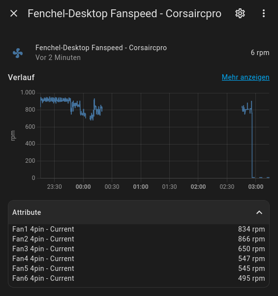

### TODO

- [ ] make gui for selecting which fan controller gets added
- [ ] finish tests
- [ ] extend constants
- [ ] attribute names
    - [ ] handle the 3/4 pin information differently than in attribute name
- [x] entity value maybe something different from first fan value
- [x] add rpm as unit of measurement
- [ ] 

At the moment i'll only do linux, though with hwmon adapting shouldnt be that bad

all fan controllers are getting added by default
the Entity State represents the amount of fans on each controller (need to find a way to handle the units)
 
