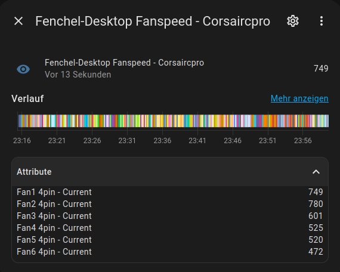

### TODO

- [ ] make gui for selecting which fan controller gets added
- [ ] finish tests
- [ ] extend constants
- [ ] attribute names
- [ ] entity value maybe somethin different from first fan value
- [ ] add rpm as unit of measurement

At the moment i'll only do linux, though with hwmon adapting shouldnt be that bad

all fan controllers are getting added by default
 

